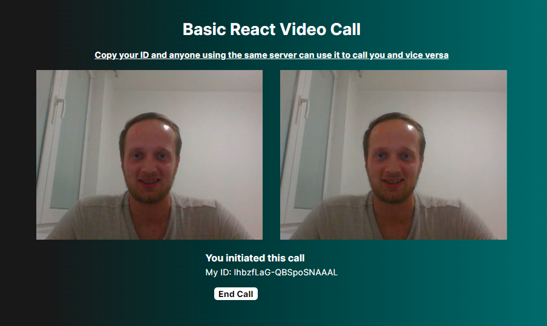

# Basic React Video Call App

This is a basic video call app that allows users to make real-time video calls through a web interface. Built with React, Node.js, and Socket.IO, it demonstrates the power of web technologies to create interactive, real-time communication solutions.

## How To Get Started
In the project directory:

### Install Dependencies
To install all the dependencies required to run the app run npm install in the project directory.

### Start the Server
To start the server run `npm run server` in the project directory.

### Start the Client
To start the client run `npm start` in the project directory.